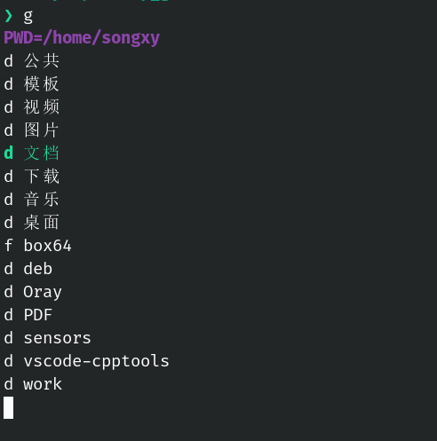

# shell
## MyJump.sh  
shell 工具，方便的切换目录。  
使用方法：  
1. 把MyJump.sh 放到任意目录。  
2. 在shell的配置文件中添加一行`. /xx/xxx/xx/MyJump.sh`  
3. 使用'g'命令，向vi一样切换目录（j,k,l,h）。  

- j 向下移动  
- k 向上移动
- l 进入选中目录（如果是目录的话）
- h 进入上一级目录

